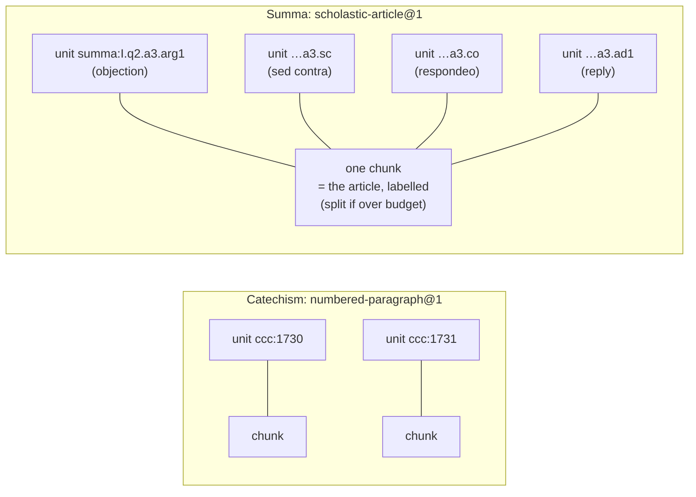

# 02 · The citable unit

## TL;DR

- The corpus's atom is a **citable unit**: a passage with a canonical address
  that predates this project, such as `ccc:1730` or `summa:I.q2.a3.co`.
- Because the address is real, a citation is **a fact that can be checked**
  (does the unit exist, and was it in the model's context?). It stops being a
  string that merely looks plausible.
- **Units are what you cite. Chunks are what you embed.** A chunk is a set of
  *whole* units, joined through `chunk_units`, so re-chunking never breaks a
  stored citation.
- Chunking is therefore **per source**, following the source's own structure.
- The same address in two languages is a **cross-lingual alignment key**, but
  only if both texts come from the same revision (the §2267 lesson).

## The idea in one comparison

| | Typical RAG | Apologia |
|---|---|---|
| How text is split | fixed windows, e.g. 512 tokens | by the source's own numbering |
| What a citation is | a chunk ID, internal and unstable | a canonical locator, public and centuries old |
| "Is this citation real?" | ask a judge model | look it up, deterministically |
| After re-chunking | every stored citation breaks | nothing breaks |

That is the whole trick. The Catechism has numbered paragraphs, the Summa has
part/question/article, and Scripture has chapter:verse. Those addresses already
exist, so we use them instead of inventing chunk IDs.

## Units vs chunks

Two jobs on two clocks. A **unit** must stay valid for years — somebody checks
it against a printed book. A **chunk** is a tuning parameter you expect to move
repeatedly. Fuse them and every tuning experiment invalidates every citation
already published. Two rules keep them composable:

- **A chunk is a set of *whole* units.** Boundaries fall on unit boundaries,
  and even a passage far over the chunker's budget is never cut in half:
  "splitting mid passage would cut a citable unit across two chunks, and a unit
  is the atom" (`lib/corpus/chunk.ts`).
- **A chunk may carry text no unit contains.** `scholastic-article@1` writes
  the article's address and a label per passage — `[Obiectio 2]`, `[Sed
  contra]`, `[Respondeo]` — into the chunk, because the role has to be *in what
  the embedding model reads*. Those labels are forbidden in `units.text`, which
  is byte-compared by the quotation gate
  ([ADR-017](../adr/017-quotation-as-verified-invariant.md)).

- **Catechism: one unit per chunk.** This is the baseline. Packing short
  neighbours together would probably help retrieval, but that is a tuning
  change, and tuning changes need an eval diff.
- **Summa: one chunk per article — usually.** An article's objections, *sed
  contra*, *respondeo* and replies only make sense together, so they are
  embedded together, and each is still cited separately. Articles are not
  uniform, though: the ones over a character budget split into consecutive
  labelled chunks, and a split article is the one case where a chunk is *not*
  self-contained, because the *respondeo* did not travel with every objection.
  How many split is a property of the corpus, so it is in
  [status.md](status.md).
- **The unit carries a `role`.** An objection states what Aquinas is about to
  *reject*. Citing `summa:I.q2.a3` (the whole article) couldn't tell "he teaches
  X" from "he rejects X". Citing `…arg1` can. That is why Summa locators are
  leaf-level.

## Why this decides so much else

| Consequence | Where it lands |
|---|---|
| Parsers are per source, and they must get the numbering *exactly* right | [chapter 04: ingestion](04-ingestion.md) |
| `chunk_units` is a join table, so the same unit can sit in chunks built by two strategies at once | [chapter 05: data model](05-data-model.md) |
| The citation gate can be a pure function | [chapter 06: query path](06-query-path.md) |
| The gold set names expected **units**, and metrics score sets of units per retrieved chunk | [chapter 07: measurement](07-measurement.md) |

## The catch: the same number must mean the same text

`ccc:2267` exists in both Hungarian and English. It aligns *only if* both
editions descend from the same revision of the work. The 1997 Hungarian text
says the death penalty is "not excluded". The 2018-revised text says it is
"inadmissible". Ingest one of each and every check stays green: the locator
resolves, the quote is byte-exact, the gate passes. The answer then teaches
opposite doctrine depending on the reader's language. That is why the manifest
requires a `revision` on every document and refuses mismatched ones before
fetching ([ADR-019](../adr/019-ccc-editions.md)).

## Where this lives in code

| File | Role |
|---|---|
| `lib/corpus/parsers/katolikus-hu.ts`, `vatican-intratext.ts`, `corpus-thomisticum.ts` | turn a source's HTML into units with locators and roles |
| `lib/corpus/chunk.ts` | `numbered-paragraph@1`, `scholastic-article@1`; the `@N` suffix means a new strategy sits *beside* the old one |
| `lib/corpus/manifest.ts` | enforces `revision` agreement across languages |
| `supabase/migrations/0005_corpus.sql` | `units`, `chunks`, `chunk_units` |

## Go deeper

- [ADR-002: The citable unit is the atom](../adr/002-citable-unit-model.md),
  the decision the others hang off
- [docs/corpus.md § Why chunking is per-source](../corpus.md#why-chunking-is-per-source)
- [ADR-019: CCC editions](../adr/019-ccc-editions.md), where unit *identity*
  had to be paid for

## Check yourself

Why does re-chunking not invalidate stored citations?

Citations point at units, and chunks only reference units through `chunk_units`.
A new chunking strategy produces new chunks linked to the same unit rows.

Why a join table, when today every unit is in exactly one chunk?

Because the *versions* are the point. `chunks.strategy` is plain text, so
`numbered-paragraph@2` can populate the corpus beside `@1` and be scored over
the same gold set — at which point one unit belongs to one chunk *per strategy*,
which no foreign key expresses. In the corpus as ingested today no unit is in
more than one chunk, so `chunk_units` is a many-to-one relation being stored in
a table that can do more. That is the capability being bought, and it is the
same trick `chunk_embeddings` plays with its `(chunk, model)` key.

Why is `summa:I.q2.a3` not a valid unit locator?

It names an article, which is a container. In this system an article is a
chunk, not a unit. Units are the role-bearing passages inside it (`.arg1`,
`.sc`, `.co`, `.ad1`), because the role determines whether Aquinas affirms or
rejects the claim.

Two editions both have §2267. Why isn't that enough for alignment?

The numbering is shared, but the content depends on the revision. Identity
requires the same revision, and that is a property of the fetch, which the
manifest must declare and check.

