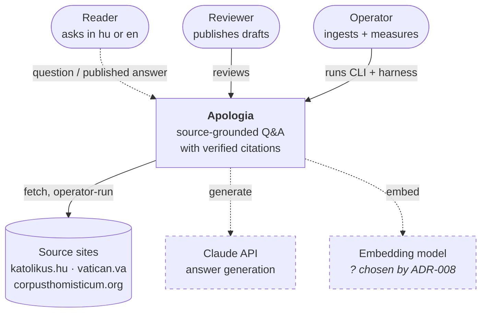
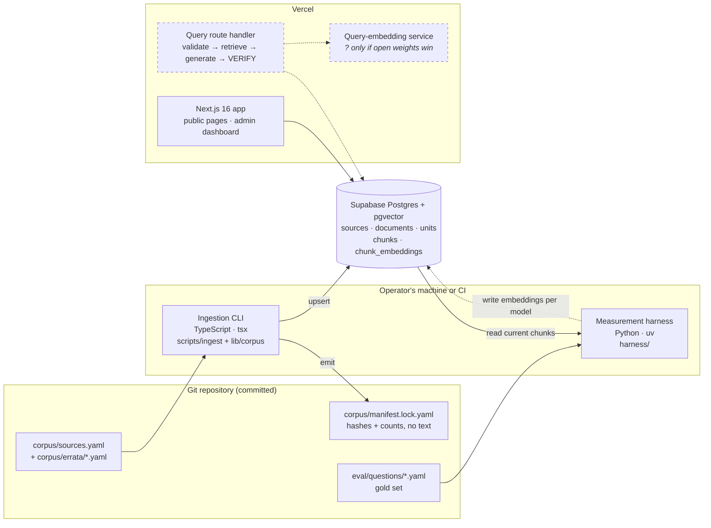

# 03 · System map

## TL;DR

- There are **three people** around the system: the **reader**, who asks; the
  **reviewer**, who publishes; and the **operator**, who ingests and measures.
- There are **two processes**: an offline **ingestion CLI** (✅ built) and an
  online **query path** (📐 planned). Ingestion is deliberately not a web
  concern.
- **One database**: Supabase Postgres with pgvector holds sources, units,
  chunks and embeddings.
- **Two languages**: TypeScript for everything a request touches and for the
  pipeline, and Python only for measurement (ADR-023).
- **The repo is the contract.** Source manifests, declared errata, the corpus
  lock file and the gold set are committed. The corpus text is not.

## Level 1: context

Who and what surrounds the system.

The reader's arrow is dashed because nobody can ask a question yet. The reviewer
can log in to the admin dashboard today, but there are no drafts to review.

## Level 2: containers

What runs, where it runs, and what it talks to.

- **The CLI and the harness never run inside a request.** They are operator
  tools. This is why the service-role key never needs to reach the deployed app
  ([ADR-004](../adr/004-offline-ingestion-cli.md)).
- **The harness writes embeddings one model at a time.** `chunk_embeddings` is
  keyed by `(chunk, model)`, so two candidates can sit side by side and be
  scored on the same gold set.
- **The query-embedding service has a `?`.** The query must be embedded by *the
  same model* that embedded the corpus. If a hosted API wins ADR-008, this box
  becomes a plain API call from the route. If open weights win, it becomes a
  Python function ([ADR-023](../adr/023-python-at-the-measurement-boundary.md)).

## Code map

Which folder is which box. Each module opens with a header comment whose first
sentence states its job, so read that sentence before anything else.

| Folder | Box | Language | State |
|---|---|---|---|
| `scripts/ingest/` | Ingestion CLI: the I/O shell (network, filesystem, Postgres) | TS | ✅ |
| `lib/corpus/` | Ingestion CLI: the pure stages (parse, assert, chunk, hash), all unit tested | TS | ✅ |
| `corpus/` | Repo contract: manifests, errata, lock file | YAML | ✅ |
| `harness/` | Measurement harness | Python | 🚧 |
| `eval/` | Gold set and (future) reports | YAML | ✅ v0 |
| `scripts/eval-lint.ts` | Checks every gold-set locator exists in the DB | TS | ✅ |
| `lib/citation/` | The citation gate, pure and ready for the query route | TS | ✅ (unwired) |
| `lib/rate-limit.ts` | Fail-closed limiter for the future ask endpoint | TS | ✅ (unwired) |
| `app/`, `components/`, `config/` | Next.js app: template landing page, login, admin dashboard | TS | ✅ template |
| `proxy.ts`, `lib/auth.ts` | Admin guard, layer 1 (proxy) and layer 2 (`requireAdmin()`) | TS | ✅ |
| `supabase/migrations/` | Schema, grants, RLS | SQL | ✅ `0005`; `0006` 📐 |
| `integration/`, `e2e/` | Tests against a real Postgres; browser tests | TS | ✅ |
| `types/` | `db.ts` (rows) → `domain.ts` (app types) → `api.ts` (wire) | TS | ✅ |

## Where this lives in code

This chapter *is* the code map, above.

## Go deeper

- [docs/architecture.md § Shape](../architecture.md#shape): both processes,
  stage by stage
- [ADR-004: Ingestion is an offline CLI](../adr/004-offline-ingestion-cli.md)
- [ADR-023: Python at the measurement boundary](../adr/023-python-at-the-measurement-boundary.md)
- [CLAUDE.md](../../CLAUDE.md): conventions (Supabase clients, grants, design
  tokens, copy)

## Check yourself

Why is ingestion a CLI and not an API route or a background job?

No user is waiting on it. It is a batch job a human starts, perhaps a dozen
times a year. As a route it would take on function time limits, timeouts and an
HTTP trigger that then needs auth and rate limits. As a queue it would need a
worker runtime and a deployment for both. Neither buys anything here. A CLI
also keeps the pipeline readable as a sequence of functions with a `main()`
(ADR-004).

Where is the boundary between TypeScript and Python, as a rule rather than a file list?

Python is allowed where the deliverable is a measurement, or the model that
produced it. Everything the request path touches, and everything already covered
by the TS unit suite, stays TypeScript (ADR-023).

Why does the query-embedding service box carry a "?"

The query and the corpus must be embedded by the same model. Whether that needs
a Python service depends on whether an open-weights model or a hosted API wins
ADR-008, and that decision hasn't been measured yet.

