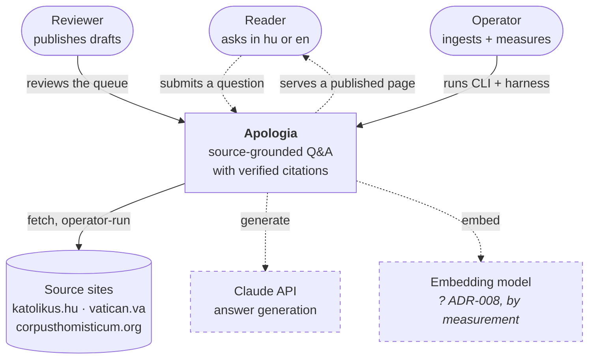
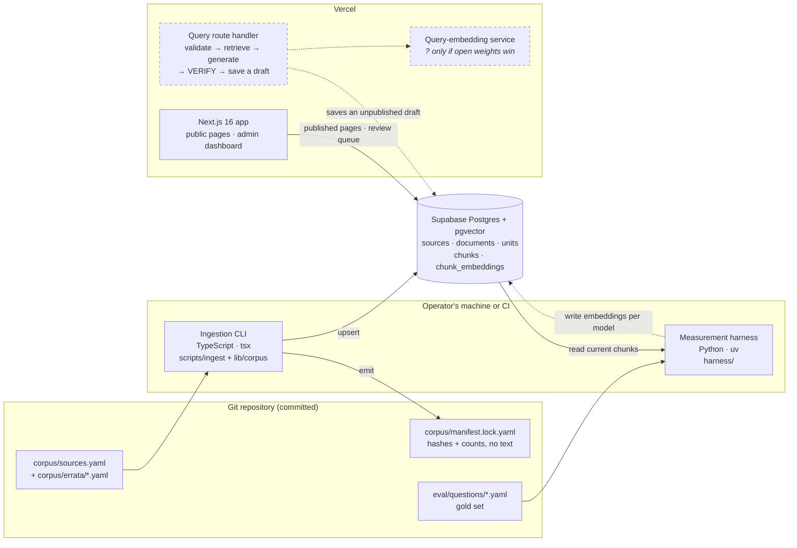

# 03 · System map

## TL;DR

- **Three people:** the **reader**, who asks; the **reviewer**, who publishes;
  the **operator**, who ingests and measures.
- **Two processes:** an offline **ingestion CLI** (✅ built) and an online
  **query path** (📐 planned). Ingestion is deliberately not a web concern.
- **One database:** Supabase Postgres with pgvector.
- **Two languages:** TypeScript for the pipeline and everything a request
  touches, Python only for measurement (ADR-023).
- **The repo is the contract.** Manifests, errata, the corpus lock file and the
  gold set are committed. The corpus text is not.
- Which folder is which box is the separate [code map](code-map.md).

## Level 1: context

Who and what surrounds the system.

**The reader has two arrows because asking and reading are not one exchange.**
Submitting a question returns no answer — it drafts one for a human, and the
reader sees it only once somebody publishes. `architecture.md`: **a write path
anyone can trigger and nobody can read, and a read path anyone can read and
nobody can trigger.** One round-trip arrow would promise the request/response
shape this design refuses.

**Dashes and `?` mean different things.** Dashed is *not built*. `?` is
stronger — the embedding model is **undecided**, and ADR-008 waits on a number
from the bake-off. Claude carries no `?` because generation is settled, though
by assumption rather than measurement, which [status.md](status.md) records as
an ADR still owed.

The operator's is the only solid arrow from a person, because both its tools
run now: the **CLI** fetches a source and writes units and chunks to Postgres;
the **harness** scores retrieval — it embeds every chunk with a candidate
model, asks the gold set's questions, and reports whether the expected units
came back. Neither ever runs in a request. The reviewer can sign in to the
admin dashboard today, but there are no drafts waiting.

## Level 2: containers

What runs, where it runs, and what it talks to.

- **Nothing in the Vercel column finishes a question.** The route's last step is
  *saving a draft*; `VERIFY` is the last **automatic** step, not the last step.
  A person stands between the draft and the page, with no queue, no SLA and no
  notification behind them ([ADR-006](../adr/006-draft-review-publish.md)). Read
  that column as two programs sharing a database: one writing drafts nobody can
  see, one serving pages nobody can trigger.
- **The CLI and the harness never run inside a request.** They are operator
  tools, which is why the service-role key never needs to reach the deployed
  app ([ADR-004](../adr/004-offline-ingestion-cli.md)).
- **The harness writes embeddings one model at a time** — `chunk_embeddings` is
  keyed `(chunk, model)` — but crowning a model is not what it is for.
  Grounding is not bought here: that is the citation gate, where `citation
  validity` should read 100% and anything lower is *a bug, not a score*.
  Retrieval quality decides whether the gate has anything worth passing, rather
  than a truthful answer to a question nobody asked. The bake-off's product is
  a **baseline**, because non-negotiable 6 makes every later retrieval,
  chunking or prompt change diff against it ([chapter 07](07-measurement.md)).
- **The query-embedding service's `?` is narrower than it looks.** Query and
  corpus must share one embedding space, so open is only *which* model: a
  hosted winner collapses this box into a call from the route, open weights
  make it a Python function. Whether a winner can be served at all is settled —
  the pre-flight made that an entry requirement rather than a discovery after
  the offline pass ([ADR-023](../adr/023-python-at-the-measurement-boundary.md)).

## Where this lives in code

Which folder is which box is its own page: **[code map](code-map.md)**. It was
split out of this chapter because a chapter that draws two C4 levels *and*
inventories thirteen folders is two chapters wearing one number.

## Go deeper

- [docs/architecture.md § Shape](../architecture.md#shape): both processes,
  stage by stage
- [ADR-004: Ingestion is an offline CLI](../adr/004-offline-ingestion-cli.md)
- [ADR-023: Python at the measurement boundary](../adr/023-python-at-the-measurement-boundary.md)
- [CLAUDE.md](../../CLAUDE.md): conventions (Supabase clients, grants, design
  tokens, copy)

## Check yourself

Why is ingestion a CLI and not an API route or a background job?

No user is waiting on it. It is a batch job a human starts, perhaps a dozen
times a year. As a route it would take on function time limits, timeouts and an
HTTP trigger that then needs auth and rate limits. As a queue it would need a
worker runtime and a deployment for both. Neither buys anything here. A CLI
also keeps the pipeline readable as a sequence of functions with a `main()`
(ADR-004).

Why does the query-embedding service box carry a "?"

The query and the corpus must be embedded by the same model, so the box's shape
follows the winner: a hosted API needs only a call from the route, open weights
need a Python service. ADR-008 has not been measured yet. Note what the `?` is
*not* about — whether a winner can be served. The pre-flight settled that by
making servability an entry requirement, after ADR-023 noticed its own case
table was missing the row "wins, and cannot be served".

A reader asks a question. When do they see an answer?

Possibly never, and certainly not in that request. The route saves a **draft**;
only a published answer is readable, and publishing is a human act with no SLA
behind it (ADR-006). The exception is a question matching an answer already
published, which is served from cache. Any design instinct that treats this as
request/response — a spinner, a websocket, a "your answer is ready" — is
answering a different product.

