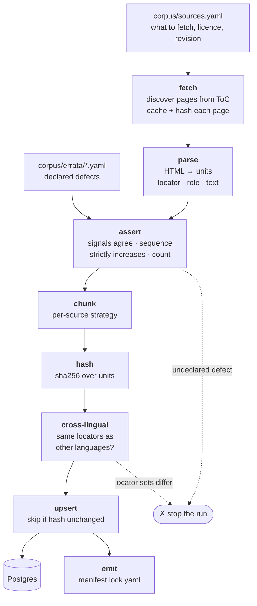
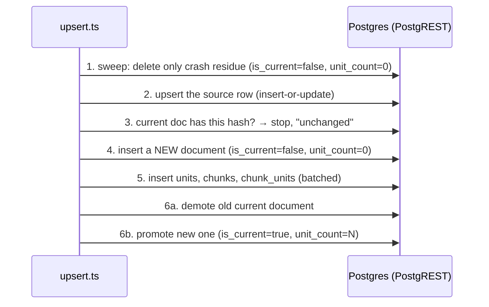

# 04 · Ingestion ✅

## TL;DR

- `npm run ingest -- --source=ccc --language=hu` takes **one document** of one
  source from web pages to Postgres. It runs from a laptop or CI, never in a
  request.
- The pipeline: **fetch → parse → assert → chunk → hash → cross-lingual →
  upsert → emit**. Pure stages sit in `lib/corpus/`; I/O sits in
  `scripts/ingest/`.
- **`assert` is the heart of it.** Real web editions contain typesetting
  errors. The rules stay strict, and every *known* defect is declared in
  `corpus/errata/`. An **undeclared** defect stops the run.
- **The `upsert` stage never updates a document** — it inserts a new one
  invisibly, then demotes the old and promotes the new. PostgREST offers no
  transactions, so ordering does that job. Superseded documents are kept.
- It is **idempotent** (same text, same hash, nothing written), **cached**
  (pages are fetched once) and **resumable** (a crashed run leaves a recognisable
  residue that the next run sweeps).

## The pipeline

Here the dashed arrows are failure exits, not planned parts. `--dry-run` stops
after `hash` and touches no database.

## What each stage guards against

| Stage | The failure it exists for |
|---|---|
| **fetch** | The page list is *discovered* from the table of contents, not pinned in a file. Each raw page is hashed for provenance, and `--refetch` bypasses the cache. |
| **parse** | Three parsers, one per source layout. They normalise text once, here, so that the byte-exact quote check later compares like with like. |
| **assert** | *Anchor ≠ printed number* (e.g. §2621). *Sequence gap or duplicate* (§146–148 were printed as 147–149). *Count ≠ expected* (a page silently failed). |
| **chunk** | Applies the source's strategy. There is no default strategy, on purpose. |
| **hash** | Hashes the *normalised units* (locator, role, text), not the HTML. A redesign of the source site is therefore a no-op, while a relabelled paragraph is a change. |
| **cross-lingual** | The Hungarian and English Catechisms must have *identical* locator sets. This is the check that turns "§1730 is §1730 in both languages" from a belief into a fact. |
| **upsert** | Writes without ever exposing a half-written document (below). |
| **emit** | Writes the committed lock file: hashes, counts, and which checks ran, e.g. `anchor_agreement: checked` vs `not applicable — one signal`. It runs even when nothing changed, so a failed emit can be recovered. |

After ingestion, **text probes** (`integration/corpus-text-probes.test.ts`)
search the *stored* text for leftover markup and footnote markers. The
assertions check the corpus's *shape*. Only the probes can tell whether a
unit's text is purely its own text.

## Upsert without transactions

**"Upsert" means insert-or-update:** write this row, and if one with the same
key is already there, update that instead of failing. It is one PostgREST call,
and the pipeline makes exactly one of them — on the `sources` row, step 2
below, because the manifest is the truth and that table is its projection.

**The document path is not an upsert, despite the stage's name.** It never
updates a document row in place. It inserts a *new* one and then changes which
one counts as current. The stage is named after its smallest operation, which
is the main reason this step reads as confusing.

**Nothing finished is ever deleted.** The one `delete` in the file is step 1,
and it matches only `is_current=false AND unit_count=0` — the state step 4
creates and step 6 clears, so no completed run can wear it. That is a crash
signature, not a cleanup: a document that has units is never a candidate. So
the table grows, on purpose, and a published citation keeps resolving to the
exact text it was verified against.

**Exactly one document per (source, language) is current.** A partial unique
index makes a second one unrepresentable, which is why 6a must precede 6b —
and it makes "which text was this citation verified against?" answerable by
construction.

**But nothing stops a query reading a superseded one.** `is_current` is a
filter every read has to remember, not a view or a policy. Forget it and the
query does not error and does not look wrong; it silently returns every edition
the corpus has ever had. `harness/apologia_eval/db.py` repeats the join on each
statement rather than hiding it behind a helper, for exactly that reason.

## Where this lives in code

| Stage | Pure logic (`lib/corpus/`) | I/O shell (`scripts/ingest/`) |
|---|---|---|
| args | — | `args.ts` (unknown flags rejected; see [war stories](10-war-stories.md)) |
| fetch | `discover/*.ts`, `manifest.ts` | `fetch.ts` |
| parse | `parsers/*.ts`, `normalise.ts`, `in-brief.ts` | — |
| assert | `assert.ts`, `errata.ts` | — |
| chunk | `chunk.ts` | — |
| hash | `hash.ts` | — |
| cross-lingual | `cross-lingual.ts` | `siblings.ts` |
| upsert | — | `upsert.ts`, `client.ts` |
| emit | — | `emit.ts` |
| probes | `probes.ts` | `integration/corpus-text-probes.test.ts` |

Orchestration: `scripts/ingest/main.ts`, one `main()`, stages in order.

## Go deeper

- [ADR-004: offline CLI](../adr/004-offline-ingestion-cli.md) ·
  [ADR-019: CCC editions and the assert step](../adr/019-ccc-editions.md) ·
  [ADR-020: a source with one signal](../adr/020-asserting-a-single-signal-source.md) ·
  [ADR-022: a source with no sibling edition](../adr/022-asserting-a-source-with-no-sibling-edition.md)
- [docs/corpus.md § Source defects are declared, not tolerated](../corpus.md#source-defects-are-declared-not-tolerated)
- The header comments of `lib/corpus/assert.ts` and `scripts/ingest/upsert.ts`

## Check yourself

Why declare defects in an errata file instead of making the parser tolerant?

A tolerant parser also accepts the *next* defect, silently. With strict rules
plus declared exceptions, only a new, undeclared fault stops the run, and a
fixed-upstream fault shows up as a stale declaration.

Why is the sequence check not redundant with the anchor check?

In §211 both signals said 210. They agreed with each other and were both wrong.
Only "strictly increasing" catches it, because 210 appears twice.

How does the upsert stay atomic without a transaction?

It builds the new document while it is invisible (`is_current=false`), then
demotes the old one and promotes the new one. A crash leaves a signature that
the next run sweeps, and no reader filtering on `is_current` sees a partial
document.

I ingested one source three times and now `documents` has three rows for it. Bug?

No — that is the design, as long as the three texts differ. Re-running with
*identical* text stops at step 3 and writes nothing, so three rows means three
different content hashes: three editions of that document, of which one is
current and two are history. They are kept because a citation published against
the second must keep resolving to the text that was verified, not to whatever
the source site says today.

What that costs: `units` grows by a full copy per ingest, and any query that
forgets `is_current` reads all three at once.

