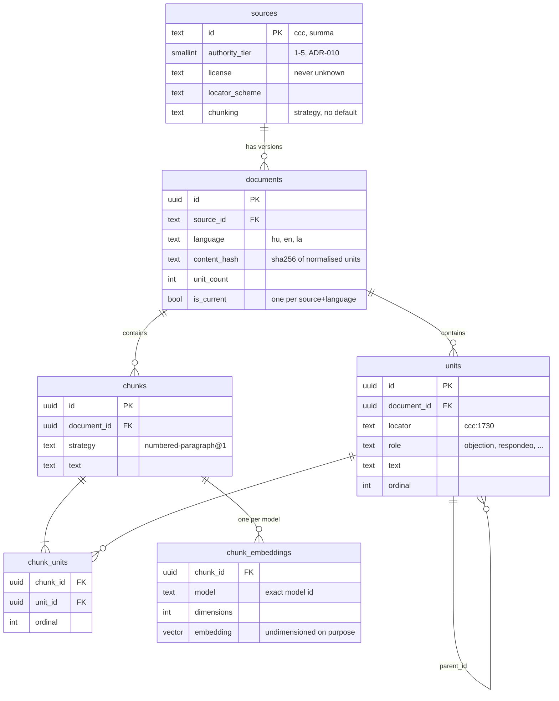
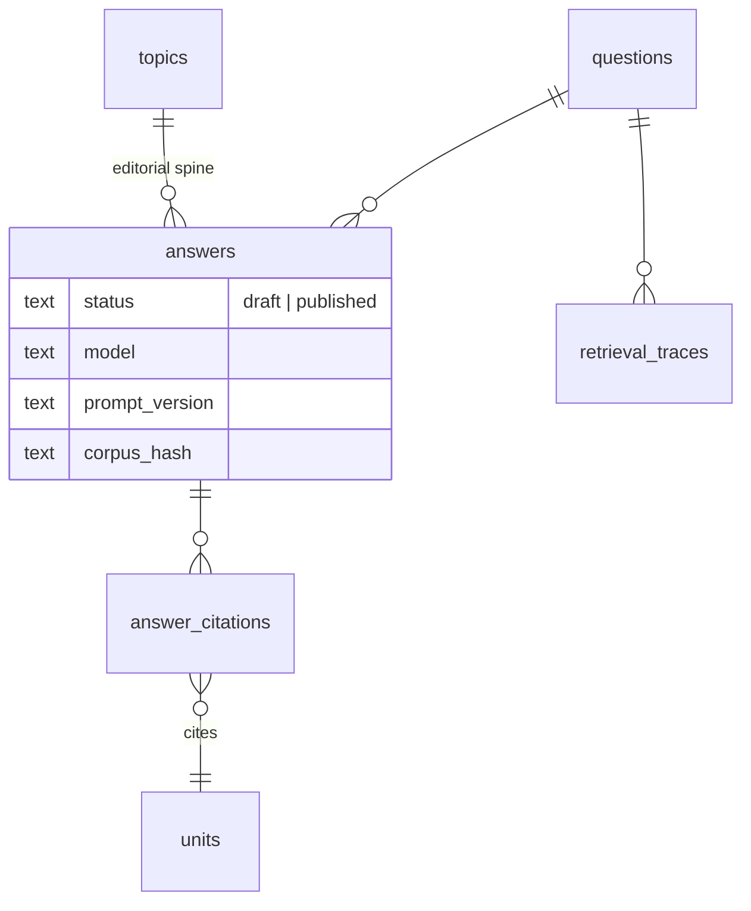

# 05 · Data model

## TL;DR

- **Source → document → unit.** A *source* is a work (the Catechism). A
  *document* is one fetched text of it in one language. A *unit* is a citable
  passage in that document.
- **Chunks are separate from units** and linked n:m through `chunk_units`.
  Embeddings are keyed by **(chunk, model)**, so several candidate models can
  coexist.
- **Superseded documents are kept, not deleted.** Every read must filter
  `documents.is_current = true`.
- **The corpus tables have no grants to `anon` or `authenticated`**, on purpose.
  Restricted magisterial text must never reach a browser.
- The answer-side tables (`answers`, `questions`, …) are 📐 planned in
  migration `0006`.

## Built: migration `0005`

Also present, inherited from the template: `admin_users` (the admin allowlist)
and `rate_limit_log` (hashed IPs for the fail-closed limiter).

## Four design choices worth being able to defend

| Choice | Why |
|---|---|
| **`chunk_units` is n:m** | A short CCC paragraph may share a chunk with its neighbour, while a Summa article is one chunk holding many units. A plain foreign key breaks in one direction or the other, and that break is what pushes projects back to fixed-window chunking. |
| **`chunk_embeddings` has no fixed dimension and no index** | pgvector needs a fixed dimension to build an index, and the dimension belongs to a model ADR-008 hasn't chosen. Fixing it in the schema would decide that question by accident. At ~9k current chunks, an exact scan takes milliseconds anyway. |
| **Documents are demoted, not deleted** | A published answer cites a unit that was verified against a specific text. Keeping superseded documents means that citation still resolves to what was verified. The cost is that **every corpus read joins `documents` on `is_current`**. |
| **At most one current document per (source, language)** | A partial unique index enforces it, so "which text was this verified against?" has one answer by construction. |

## Planned: migration `0006` 📐

`answers` will be the **only** table with `grant select to anon`, and it is
paired with an RLS policy of `status = 'published'`. Two independent layers
then say the same thing: the public sees published answers and nothing else.
`retrieval_traces` is both the observability log and the data the eval harness
scores against.

## Privileges in one paragraph

`anon` and `authenticated` start with **no** privileges on any table, including
future ones. Each table is granted back explicitly in `0004_schema_grants.sql`.
A grant decides whether a role may touch the table at all. RLS decides which
rows it sees. You need both, and a policy without a grant fails with
`permission denied for table …`, which looks like an API-key problem and isn't.

## Where this lives in code

| File | What |
|---|---|
| `supabase/migrations/0005_corpus.sql` | the corpus tables; comments explain each index |
| `supabase/migrations/0004_schema_grants.sql` | deny-by-default, then per-table grants |
| `types/db.ts` → `types/domain.ts` | raw rows → app types, mapped at the data-access layer |
| `scripts/eval-lint.ts` | the reference example of a correct `is_current` read |

## Go deeper

- [docs/architecture.md § Data model](../architecture.md#data-model-0005-built-and-populated-0006-planned)
- [ADR-001: pgvector](../adr/001-pgvector-as-vector-store.md) ·
  [ADR-006: draft → publish](../adr/006-draft-review-publish.md) ·
  [ADR-010: authority tiers](../adr/010-authority-tiers.md) ·
  [ADR-016: editorial spine](../adr/016-editorial-spine.md)

## Check yourself

Why can't `chunk_embeddings.embedding` be `vector(1024)`?

The dimension is a property of the embedding model, which hasn't been chosen.
Fixing it would silently exclude candidates with other dimensions from the
bake-off.

What goes wrong if a corpus query forgets `is_current = true`?

It reads superseded documents too. The database holds more chunks than are
current, so retrieval or scoring would silently include text that is no longer
the corpus.

Grant vs RLS: which is which?

A grant says whether a role may touch the table at all. RLS says which rows.
The public answer path uses both: `grant select` plus `status = 'published'`.

