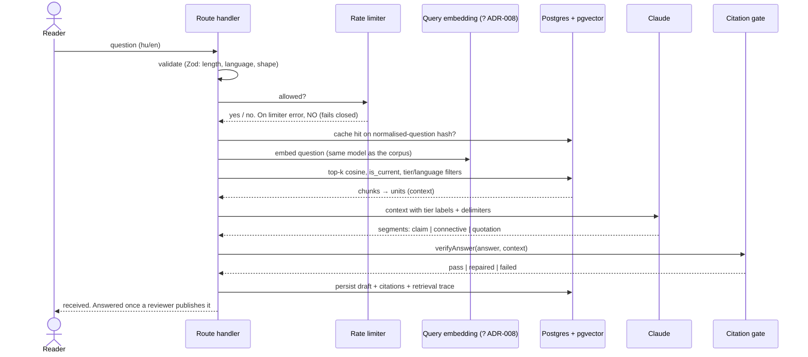
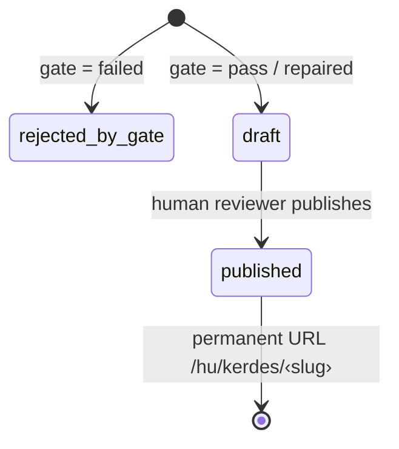

# 06 · Query path 📐

> **Planned.** No route exists yet. Two of its parts are already built and
> tested on their own: the citation gate (`lib/citation/verify.ts`) and the
> fail-closed rate limiter (`lib/rate-limit.ts`). The rest is the contract the
> remaining work implements against.

## TL;DR

- One question in, **one verified draft** out. There is no chat, no agent loop
  and no streaming.
- The model returns a **structured answer** made of segments: `claim` (with
  citations), `connective`, and `quotation` (a locator plus an exact span). The
  model marks its own claims, and the gate checks them.
- **The citation gate is deterministic and runs before anything is shown.**
  Every citation must name a unit *that was in the model's context*, every claim
  must keep at least one citation, and every quotation must match its unit
  **byte for byte**.
- The gate returns **pass**, **repaired** (bad citations dropped, answer still
  sound) or **failed**. It never passes silently.
- A draft becomes public only when **a human publishes it** at a permanent URL.

## One question, end to end

## The gate, in three rules

| Rule | Violation | Outcome |
|---|---|---|
| A cited locator must be **in the supplied context**, not merely in the corpus | `citation_not_in_context` | citation dropped |
| Every `claim` must keep **≥ 1 citation** after drops | `claim_without_citation` | **answer fails** |
| A quotation must appear **verbatim** in its unit's text | `quotation_not_exact` | **answer fails** (fabrication) |
| Quotations must stay proportionate (length and ratios) and be attributed | `quotation_too_long`, `…_ratio`, `…_missing_attribution` | per ADR-017 |

Two things matter when you reason about the gate:

1. **The context is the whole universe.** A real locator that the model wasn't
   shown counts as fabricated. The model can't have been reading it, and a
   database lookup would turn a lucky guess into a pass.
2. **The comparison is deliberately unforgiving.** A curly apostrophe against a
   straight one fails. Normalisation happens once, at ingestion, and never in
   the gate. A lenient comparison could be talked into accepting a quotation
   the source never wrote.

## Draft to published

A gate failure never becomes a draft. A draft is never public. Only
`published` rows are readable by `anon`, and both the grant and the RLS policy
enforce that ([chapter 05](05-data-model.md)). Every automated check here
establishes that an answer is *grounded*, and only a reviewer can judge whether
it is *right*. The side effects are large:

- there is no anonymous LLM endpoint to abuse
- published answers are static, cacheable and indexable
- reviewed Q&A pairs accumulate as evaluation data

The cost is that the first person to ask a new question doesn't get an
immediate answer.

## Translate the explanation, never the quotation

The answer's prose is generated in the reader's language, and that is authorship.
A quotation is shown only in a language that has an authoritative text. If no
Hungarian edition exists, the quotation is shown in English and labelled as
such, never machine-translated. The byte-exact rule is what enforces this: a
translated quote cannot match its unit
([ADR-014](../adr/014-translation-and-quotation.md)).

## Where this lives in code

| Part | File | State |
|---|---|---|
| Citation gate | `lib/citation/verify.ts` (+ `verify.test.ts`) | ✅ built, unwired |
| Quotation limits | `lib/citation/limits.ts` | ✅ |
| Segment and result types | `types/domain.ts` (`AnswerSegment`, `VerificationResult`) | ✅ |
| Rate limiter + budget constants | `lib/rate-limit.ts`, `lib/constants.ts` | ✅ unwired |
| Route handler, prompt, persistence, review UI | — | 📐 |

## Go deeper

- [ADR-005: verify, then display](../adr/005-verify-then-display.md) ·
  [ADR-006: draft, review, publish](../adr/006-draft-review-publish.md) ·
  [ADR-009: fail-closed limiter](../adr/009-fail-closed-rate-limiting.md)
- [ADR-017: quotation as a verified invariant](../adr/017-quotation-as-verified-invariant.md) ·
  [ADR-018: segmented answers](../adr/018-segmented-answers.md)
- [docs/architecture.md § Query path](../architecture.md#2-query-path--a-route-handler-planned-milestone-1)

## Check yourself

The model cites `ccc:1730`, which exists in the corpus, but it wasn't retrieved. Pass or drop?

Drop. The gate's universe is the context the model was given. If the model
wasn't shown the unit, the citation is a guess, even if it happens to be right.

Why does the rate limiter fail closed here, when the template's failed open?

The template protects contact forms, where losing a real enquiry is the costly
outcome. Here every accepted request spends money, and a limiter outage is when
abuse is most likely (ADR-009).

Why does the model mark its own claims instead of the gate detecting them?

Code can't decide whether a sentence asserts something. That judgement would
need a model inside the gate, and the gate would stop being deterministic. So
the model labels its own segments, and the gate checks the structural part:
set membership and string equality. A mislabelled claim can still slip through
as a `connective`, but that is now a measurable behaviour of the generator,
scored by the eval harness, instead of a hidden hole in a check advertised as
deterministic (ADR-018).

