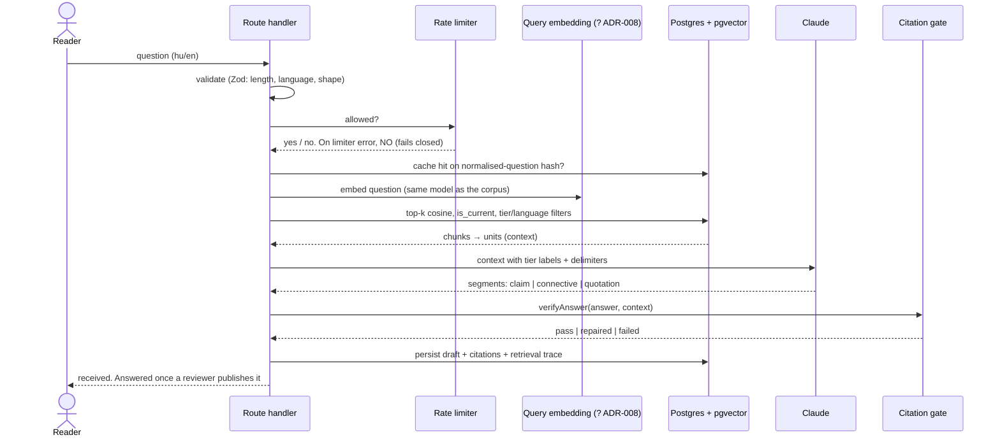
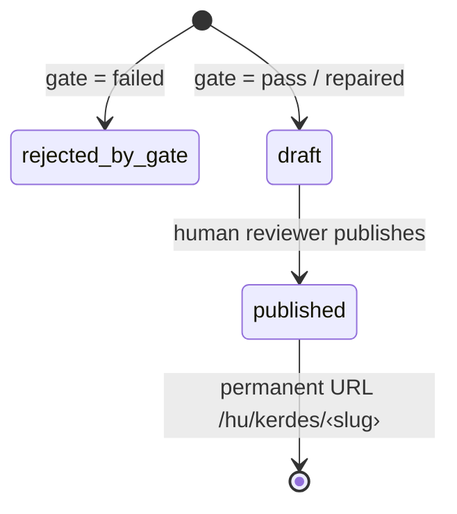

# 06 · Query path 📐

> **Planned.** No route exists yet. Two of its parts are already built and
> tested on their own: the citation gate (`lib/citation/verify.ts`) and the
> fail-closed rate limiter (`lib/rate-limit.ts`). The rest is the contract the
> remaining work implements against.

## TL;DR

- One question in, **one verified draft** out. There is no chat, no agent loop
  and no streaming.
- The model returns a **structured answer** made of segments: `claim` (with
  citations), `connective`, and `quotation` (a locator plus an exact span). The
  model marks its own claims, and the gate checks them.
- **The citation gate is deterministic and runs before anything is shown.**
  Every citation must name a unit *that was in the model's context*, every claim
  must keep at least one citation, and every quotation must match its unit
  **byte for byte**.
- The gate returns **pass**, **repaired** (bad citations dropped, answer still
  sound) or **failed**. It never passes silently.
- A draft becomes public only when **a human publishes it** at a permanent URL.

## One question, end to end


```mermaid
sequenceDiagram
  actor R as Reader
  participant API as Route handler
  participant RL as Rate limiter
  participant E as Query embedding (? ADR-008)
  participant DB as Postgres + pgvector
  participant LLM as Claude
  participant G as Citation gate

  R->>API: question (hu/en)
  API->>API: validate (Zod: length, language, shape)
  API->>RL: allowed?
  RL-->>API: yes / no. On limiter error, NO (fails closed)
  API->>DB: cache hit on normalised-question hash?
  API->>E: embed question (same model as the corpus)
  API->>DB: top-k cosine, is_current, tier/language filters
  DB-->>API: chunks → units (context)
  API->>LLM: context with tier labels + delimiters
  LLM-->>API: segments: claim | connective | quotation
  API->>G: verifyAnswer(answer, context)
  G-->>API: pass | repaired | failed
  API->>DB: persist draft + citations + retrieval trace
  API-->>R: received. Answered once a reviewer publishes it
```

**What a question costs.** Two paid calls, in this order: one to *embed the
question*, one to *generate the answer*. Both sit after the limiter and after
the cache, so a repeated question costs neither — that is what makes `cache` a
cost control rather than a latency trick. The model is called **once**: it
returns the whole segmented answer in one response, because there is no chat
and no agent loop. If an open-weights model wins ADR-008 the embedding becomes
our own compute rather than a bill, but it is still work an attacker can make
us do.

## What comes back

```json
{
  "language": "hu",
  "segments": [
    { "kind": "claim",
      "text": "A Katekizmus szerint Isten gondot visel minden teremtményére.",
      "citations": ["ccc:309"] },
    { "kind": "connective",
      "text": "A kérdés éppen ezért éles:" },
    { "kind": "quotation",
      "locator": "ccc:309",
      "text": "miért van mégis a rossz?" }
  ]
}
```

- **`claim`** — an assertion the reader is asked to believe. It must carry at
  least one citation, and every citation must name a unit that was in the
  context.
- **`connective`** — glue. Asserts nothing, so it needs no citation. Whether a
  sentence is really glue is the model's judgement, which is the one soft spot
  in an otherwise deterministic gate.
- **`quotation`** — a locator plus a span, compared byte for byte against that
  unit's stored text. Never translated ([ADR-014](../adr/014-translation-and-quotation.md)).

> ⚠️ The Hungarian above is invented, exactly as the gate's own fixtures are.
> The repo ships no corpus text ([ADR-003](../adr/003-ship-manifests-not-corpus.md)),
> and an example using the real wording would be an example that shipped it.

## The gate, rule by rule

| Rule | Violation | Outcome |
|---|---|---|
| A cited locator must be **in the supplied context**, not merely in the corpus | `citation_not_in_context` | that citation dropped |
| Every `claim` must keep **≥ 1 citation** after drops | `claim_without_citation` | **answer fails** |
| A quotation's locator must be in the context too | `quotation_unknown_locator` | **answer fails** |
| The span must appear **byte for byte** in its unit | `quotation_not_exact` | **answer fails** |
| Quotations stay proportionate and name their source | `quotation_too_long`, `…_exceeds_unit_ratio`, `…_exceeds_answer_ratio`, `…_missing_attribution` | that quotation dropped |

**Fabrication is fatal; disproportion is repaired.** A span the source never
wrote cannot be fixed by deleting it — it means the model invented text, and
nothing else it said is trustworthy either. A quotation that is merely too long
*can* be dropped, because "the answer's own prose carries the claim regardless"
(`verify.ts`). That asymmetry is the whole design of `repaired`.

**The comparison is deliberately unforgiving.** A curly apostrophe against a
straight one fails. All normalisation happens once, at ingestion, and never in
the gate — a lenient comparison is one that can be talked into accepting a
quotation the source never wrote.

## Draft to published


```mermaid
stateDiagram-v2
  [*] --> rejected_by_gate: gate = failed
  [*] --> draft: gate = pass / repaired
  draft --> published: human reviewer publishes
  published --> [*]: permanent URL /hu/kerdes/‹slug›
```

A gate failure never becomes a draft. A draft is never public. Only
`published` rows are readable by `anon`, and both the grant and the RLS policy
enforce that ([chapter 05](05-data-model.md)). Every automated check here
establishes that an answer is *grounded*, and only a reviewer can judge whether
it is *right*. The side effects are large:

- there is no anonymous LLM endpoint to abuse — nobody can use this as a free
  proxy, because the caller never sees the text. That removes the abuse of
  *consuming* output and does nothing about the cost of *producing* it, which
  is why the limiter is still load-bearing
- published answers are static, cacheable and indexable
- reviewed Q&A pairs accumulate as evaluation data

The cost is that the first person to ask a new question doesn't get an
immediate answer.

## Translate the explanation, never the quotation

The answer's prose is generated in the reader's language, and that is authorship.
A quotation is shown only in a language that has an authoritative text. If no
Hungarian edition exists, the quotation is shown in English and labelled as
such, never machine-translated. The byte-exact rule is what enforces this: a
translated quote cannot match its unit
([ADR-014](../adr/014-translation-and-quotation.md)).

## Where this lives in code

| Part | File |
|---|---|
| Citation gate | `lib/citation/verify.ts` (+ `verify.test.ts`, where the fixtures above come from) |
| Quotation limits, and the legal judgement behind the numbers | `lib/citation/limits.ts` |
| Segment and result types | `types/domain.ts` (`AnswerSegment`, `VerificationResult`) |
| Rate limiter + budget constants | `lib/rate-limit.ts`, `lib/constants.ts` |
| Route handler, prompt, persistence, review UI | not written yet |

Which of these exist today is the banner at the top of this chapter, and
[status.md](status.md) in full.

## Go deeper

- [ADR-005: verify, then display](../adr/005-verify-then-display.md) ·
  [ADR-006: draft, review, publish](../adr/006-draft-review-publish.md) ·
  [ADR-009: fail-closed limiter](../adr/009-fail-closed-rate-limiting.md)
- [ADR-017: quotation as a verified invariant](../adr/017-quotation-as-verified-invariant.md) ·
  [ADR-018: segmented answers](../adr/018-segmented-answers.md)
- [docs/architecture.md § Query path](../architecture.md#2-query-path--a-route-handler-planned-milestone-1)

## Check yourself

<details><summary>The model cites `ccc:1730`, which exists in the corpus, but it wasn't retrieved. Pass or drop?</summary>

Drop. The gate's universe is the context the model was given. If the model
wasn't shown the unit, the citation is a guess, even if it happens to be right.
</details>

<details><summary>The limiter's backing store is down. Does the next question go through?</summary>

No — it fails closed, which is the opposite of what a contact form should do.
The asymmetry decides it: rejecting a genuine question costs a reader one
retry, while accepting a flood spends an embedding call and a generation call
each time. And an outage is exactly when abuse is most likely, because a
limiter is disproportionately likely to be down *because* someone is hammering
it (ADR-009).
</details>

<details><summary>Why does the model mark its own claims instead of the gate detecting them?</summary>

Code can't decide whether a sentence asserts something. That judgement would
need a model inside the gate, and the gate would stop being deterministic. So
the model labels its own segments, and the gate checks the structural part:
set membership and string equality. A mislabelled claim can still slip through
as a `connective`, but that is now a measurable behaviour of the generator,
scored by the eval harness, instead of a hidden hole in a check advertised as
deterministic (ADR-018).
</details>
