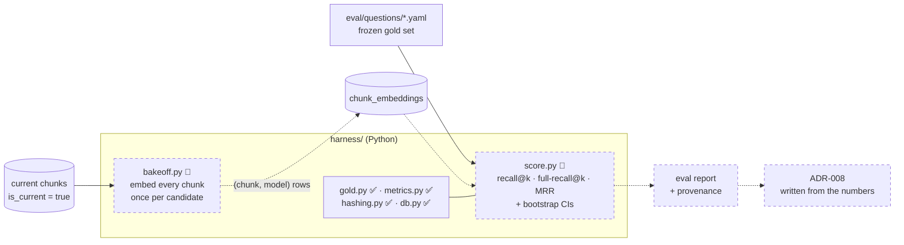

# 07 · Measurement 🚧

## TL;DR

- **"Better" must mean a number that moved on a frozen gold set.** Any change
  to retrieval, chunking, embeddings or the prompt must attach an eval report
  diff. Every question that stops passing is named and justified in review;
  CI does not run the eval.
- **The gold set came first**: 10 hand-written questions (v0), frozen in git
  *before* any retriever existed, so the benchmark can't be fitted to the system
  it judges.
- **The embedding model (ADR-008) will be chosen by a bake-off, not by model
  cards.** Every candidate embeds the same chunks. Each is scored on the same
  questions, and the report includes confidence intervals, because n is small.
- **Retrieval uses one embedding space.** The query and the corpus must be
  embedded by *the same* model, so whatever wins must also run at request time.
- **The harness is Python.** The deliverable is a measurement, and Python has
  honest tooling for it: model exports and bootstrap statistics (ADR-023).

## The measurement loop

## What is measured

**Retrieval** (the bake-off needs only this part):

| Metric | Meaning |
|---|---|
| `recall@k` (k = 5, 10, 20) | at least one expected unit is in the top k |
| `full-recall@k` | *all* expected units are in the top k. This is the one that matters for multi-source questions |
| `MRR@10` | 1 / rank of the first hit |

Every metric is **split into same-language and cross-lingual slices**. A
Hungarian question whose best sources are English is the case most likely to be
weak, and an aggregate would hide it.

**Generation** (once the query path exists): *citation validity* and *quote
fidelity* must read 100%, because anything less is a gate bug, not a quality
score. *Authority correctness* is the domain metric: an answer can be perfectly
cited and still present a theologian's opinion as Church teaching. *Refusal
correctness* is measured in both directions, so a system can't score well by
refusing everything.

## One subtle modelling decision

Retrieval returns **chunks**, while the gold set expects **units**, and a Summa
chunk covers a whole article of about 7 units. So a ranked result is a list of
*sets* of units. Flattening it would let one Summa chunk at rank 1 count as
seven hits and would inflate every score (`harness/apologia_eval/metrics.py`).

## Provenance, or it isn't evidence

Every report records the **corpus hash**, the embedding model, the generation
model and the prompt version. For the bake-off it also records **max sequence
length and a truncation count** per candidate. About 80% of Summa chunks exceed
2,048 characters, against about 0% of Catechism chunks, so a 512-token model
truncates most of the Summa, and comparing it with an 8k-token model would
mostly measure window size.

The corpus hash is computed in TypeScript at ingestion and **reproduced
byte-for-byte in Python** (`hashing.py`), and a test pins the two together.

## The honest outcome table (from ADR-023, written before the result)

| If… | Then |
|---|---|
| an open-weights model wins **and can be served** | the Python query-embedding service runs it |
| a hosted API wins and its licence permits sending the corpus | a thin API call; Python was only needed offline |
| a hosted API wins but the licence forbids it | a local model is used, and ADR-008 must say *"X scored highest; Y is chosen because X is not licensable"*, not that local won on merit |
| an open-weights model wins but **cannot be served** | there is no query path with it at all. Added 2026-09-15 — the row the table did not have |

That last row is why servability is measured **before** a candidate competes,
not after. Retrieval lives in one embedding space, so the model that embedded
the corpus must also embed the question; a winner with no serving route is not a
cheap option with a caveat, it is unusable — and the offline pass costs hours per
candidate before anyone finds out.

`npm run eval:preflight` establishes it: does the model export, how large is the
artifact, and **does the export still rank the way the original does**. That
second question is ADR-023's own provenance argument turned on our own export —
if a quantized artifact is what serves queries, the quantized artifact is what
has to be measured.

## Where this lives in code

| File | What | State |
|---|---|---|
| `eval/questions/q-*.yaml` | the gold set | ✅ v0 (10) |
| `scripts/eval-lint.ts` | every expected locator exists in the DB | ✅ |
| `harness/apologia_eval/gold.py` | reads and validates the gold set (pydantic) | ✅ |
| `harness/apologia_eval/metrics.py` | the three retrieval metrics, hand-verified tests | ✅ |
| `harness/apologia_eval/hashing.py` | corpus-hash port, pinned to TS output | ✅ |
| `harness/apologia_eval/db.py` | reads current chunks, writes vectors, cosine search | ✅ |
| `bakeoff.py`, `score.py` | embed, score | 📐 |

## Go deeper

- [docs/evaluation.md](../evaluation.md): full metric definitions and the
  release rule
- [ADR-023: Python at the measurement boundary](../adr/023-python-at-the-measurement-boundary.md)
- [eval/README.md](../../eval/README.md) · [harness/README.md](../../harness/README.md)
- [Python learning path](python/README.md), if the harness code is new to you

## Check yourself

Why can't the corpus be embedded with an open model offline and queries with a hosted API?

Vectors are only comparable within one model's space. The cosine between them
would be noise, and nothing would raise an error.

Why no target numbers like "recall@10 ≥ 0.8" in advance?

Nobody knows what this corpus supports, so such a number would be invented. It
would either be cleared trivially or quietly lowered. What gets fixed in advance
is the part hindsight can corrupt: metric definitions, the gold set and the
release rule. The first baseline then becomes the number to beat.

Why confidence intervals?

Only 8 of the 10 v0 questions are scorable for retrieval (two test refusal), so
one question moves `recall@k` by 12.5 points. A point estimate would look
precise and mean little. The interval makes that thinness visible.

