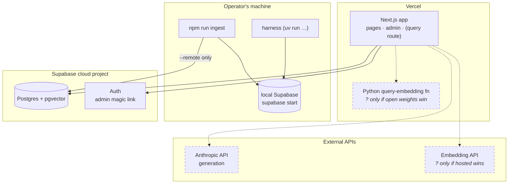

# 08 · Infrastructure

## TL;DR

- **Three places code runs.** The **Vercel** deployment is the web app, and the
  hosting target per ADR-004. The **operator's machine** runs the ingestion CLI
  and the harness. **GitHub Actions** runs CI against a throwaway local
  database.
- **One managed service holds state:** a Supabase project (Postgres, Auth,
  pgvector). There is no queue, no vector DB, no cache server and no worker.
- **CI never touches production.** It boots an ephemeral local Supabase stack
  on the runner and uses its demo keys.
- **The privileged key never reaches the deployment.** The service-role key is
  operator-only. The embedding key may have to reach the deployment, depending
  on ADR-008.
- Two boxes carry a **`?`** because ADR-008 hasn't been measured yet.

## Deployment view

Only one of the two `?` boxes will exist. The query must be embedded by the
model that embedded the corpus
([ADR-023](../adr/023-python-at-the-measurement-boundary.md)). CI (GitHub
Actions) isn't drawn because it never touches any of these: it boots its own
local stack on the runner (see the gates table below).

## Where each secret lives

| Variable | Operator machine | Vercel (deployed) | CI | Why |
|---|---|---|---|---|
| `NEXT_PUBLIC_SUPABASE_URL`, `…_PUBLISHABLE_KEY` | ✅ | ✅ | local demo values | safe to expose; RLS and grants protect the data |
| `SUPABASE_SERVICE_ROLE_KEY` | ✅ | **never** | local demo value | bypasses RLS; only operator tools (the ingest CLI, `eval:lint`) use it (ADR-004) |
| `DB_URL` (Postgres connection string) | ✅ for the harness | **never** | local | `harness/apologia_eval/db.py` reads through psycopg, which is just as privileged as the service-role key. It refuses a non-local target without `--remote`, the same guard the ingest CLI uses |
| `ANTHROPIC_API_KEY` | — | 📐 yes | — | generation happens in the query route |
| `EMBEDDING_API_KEY` | ✅ if a hosted candidate is measured | ❓ only if a hosted API wins | — | queries are embedded at request time (ADR-023) |

The documented list is [`.env.example`](../../.env.example). No real values are
committed.

## The gates between a change and `main`

| Gate | When | Runs | Budget |
|---|---|---|---|
| `lefthook` pre-commit | `git commit` | ESLint on staged files | seconds |
| `lefthook` pre-push | `git push` | `tsc --noEmit`, `npm test`, `npm run docs:lint` | seconds |
| CI `harness` lane | every PR | ruff, format check, mypy `--strict`, pytest | under a minute |
| — its extras | — | installs `db` (psycopg) and `stats` (numpy/scipy/pandas) so `mypy` really typechecks that code instead of skipping it as an unresolved import — and so the lane matches the environment mypy passes in on an operator's machine. **Never** `local-models` or `export`: torch is gigabytes and this lane has a one-minute budget | — |
| CI `verify` lane | every PR | lint, types, unit, docs structure, **local Supabase** + integration, build, E2E | a few minutes |
| Release rule | any retrieval, chunking, embedding or prompt change | an eval report diff attached to the PR | human review |

The unit suites run **before** the database boots, on purpose. A parser or
metric regression then fails in seconds instead of after a stack boot and a
build.

## What deliberately isn't here

No queue or workers (ADR-004), no dedicated vector DB (ADR-001), no cache
server (published answers are static pages, ADR-006), no scheduled jobs, and no
infrastructure-as-code: the whole footprint is two managed services plus CI.
A reader who clones the repo reaches a working system with Supabase and an API
key.

## Where this lives in code

| File | What |
|---|---|
| `.github/workflows/ci.yml` | both CI lanes; comments explain the ordering |
| `lefthook.yml` | local git hooks |
| `supabase/config.toml`, `supabase/migrations/` | local stack and schema |
| `scripts/ingest/client.ts` | CLI target selection; `--remote` is required to write to the cloud |
| `scripts/e2e.sh`, `scripts/integration.sh` | the local-stack wrappers CI mirrors |
| `.env.example` | every variable, by name |

## Go deeper

- [ADR-004: offline ingestion CLI](../adr/004-offline-ingestion-cli.md): why
  no web job, and the key-scoping side effect
- [ADR-023 § Consequences](../adr/023-python-at-the-measurement-boundary.md#consequences):
  the Python bundle-size constraint on Vercel
- [ADR-015: testing strategy](../adr/015-testing-strategy.md) and
  [TESTING.md](../../TESTING.md)

## Check yourself

Why does the CLI have no localhost guard, unlike the E2E seed?

Ingesting into production is a legitimate operator action. It just has to be
*chosen*, with `--remote`, rather than inherited from whatever `.env.local`
happens to contain.

Which secret would be catastrophic in the Vercel env, and why isn't it there?

The service-role key, because it bypasses RLS. Only offline tools use it, and
no request path needs it.

Why is the Python function's box marked "?" and not simply planned?

It exists only if an open-weights model wins ADR-008. If a hosted API wins, the
route calls that API directly and the box disappears.

